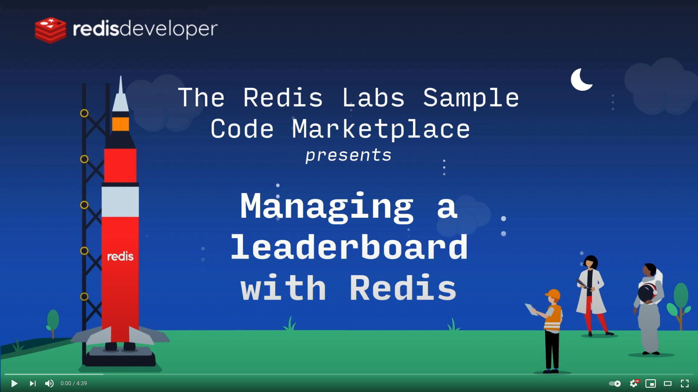

# Basic Redis Leaderboard Demo Golang

Show how the redis works with Golang.

## Screenshots


# Overview video

Here's a short video that explains the project and how it uses Redis:

[](https://www.youtube.com/watch?v=zzinHxdZ34I)

# How it works?

## How the data is stored:

- The AAPL's details - market cap of 2,6 triillions and USA origin - are stored in a hash like below:
  - E.g `HSET "company:AAPL" symbol "AAPL" market_cap "2600000000000" country USA`
- The Ranks of AAPL of 2,6 trillions are stored in a <a href="https://redislabs.com/ebook/part-1-getting-started/chapter-1-getting-to-know-redis/1-2-what-redis-data-structures-look-like/1-2-5-sorted-sets-in-redis/">ZSET</a>.
  - E.g `ZADD companyLeaderboard 2600000000000 company:AAPL`

## How the data is accessed:

- Top 10 companies:
  - E.g `ZREVRANGE companyLeaderboard 0 9 WITHSCORES`
- All companies:
  - E.g `ZREVRANGE companyLeaderboard 0 -1 WITHSCORES`
- Bottom 10 companies:
  - E.g `ZRANGE companyLeaderboard 0 9 WITHSCORES`
- Between rank 10 and 15:
  - E.g `ZREVRANGE companyLeaderboard 9 14 WITHSCORES`
- Show ranks of AAPL, FB and TSLA:
  - E.g `ZSCORE companyLeaderBoard company:AAPL company:FB company:TSLA`
- Adding market cap to companies:
  - E.g `ZINCRBY companyLeaderBoard 1000000000 "company:FB"`
- Reducing market cap to companies:
  - E.g `ZINCRBY companyLeaderBoard -1000000000 "company:FB"`
- Companies over a Trillion:
  - E.g `ZCOUNT companyLeaderBoard 1000000000000 +inf`
- Companies between 500 billion and 1 trillion:
  - E.g `ZCOUNT companyLeaderBoard 500000000000 1000000000000`

### Code Example: Get top 10 companies

```Go
func (c Controller) Top10() ([]*Company, error) {
    companies, err := c.r.ZRevRange(keyLeaderBoard, 0, 9)
    if err != nil {
        return nil, err
    }
    c.buildCompanies(companies)
    c.buildRanks(companies)
    return companies, nil
}
```

## How to run it locally?

#### Copy `.env.example` to create `.env`. And provide the values for environment variables if needed

- REDIS_HOST: Redis server host
- REDIS_PORT: Redis server port
- REDIS_PASSWORD: Password to the server

#### Run demo

```sh
go get
go run
```

Follow: http://localhost:5000

## Try it out

<p>
    <a href="https://heroku.com/deploy" target="_blank">
        
    <a>
</p>

<p>
    <a href="https://deploy.cloud.run" target="_blank">
        
    </a>

    (See notes: How to run on Google Cloud)

</p>

## How to run on Google Cloud

<p>
    If you don't have redis yet, plug it in  (https://spring-gcp.saturnism.me/app-dev/cloud-services/cache/memorystore-redis).
    After successful deployment, you need to manually enable the vpc connector as shown in the pictures:
</p>

1. Open link google cloud console.


2. Click "Edit and deploy new revision" button.


3. Add environment.


4.  Select vpc-connector and deploy application.


<a href="https://github.com/GoogleCloudPlatform/cloud-run-button/issues/108#issuecomment-554572173">
Problem with unsupported flags when deploying google cloud run button
</a>
